# Quartiles Solver: Part I

In this three-part series and the associated
[project](https://github.com/xebia-functional/quartiles-solver), we are going to
~~spoil~~ enhance the fun of Apple News+ [Quartiles](https://www.apple.com/newsroom/2024/05/apple-news-plus-introduces-quartiles-a-new-game-and-offline-mode-for-subscribers/)
by developing an efficient solver for it. We will use the
[Rust](https://www.rust-lang.org/) programming language and the
[Ratatui](https://ratatui.rs/) terminal user interface (TUI) library. Along the
way, we'll learn a bit about Rust, game theory, combinatorics, benchmarking, and
TUIs. To experiment with the finished app, you'll need to pull the
[project](https://github.com/xebia-functional/quartiles-solver) locally. You can
follow the detailed instructions in the
[`README.md`](https://github.com/xebia-functional/quartiles-solver/blob/main/README.md)
to build, use, test, benchmark, or install the project on Windows, macOS, or
Linux.

In this first post, we'll introduce Quartiles, analyze why it's a good candidate
for automated solution, and finally build the dictionary that the solver will
leverage in the second post.

## Quartiles: A fully reconstructible perfect information game

Broadly speaking, Quartiles comprises three elements:

1. A _game board_ constructed by chopping up 5 long English words into smaller
   _word fragments_, each comprising 2 to 4 letters, such that there are no
   duplicate word fragments. The word fragments obtained from the 5 words are
   all scrambled together and then arranged to form a 4×5 game board of 20
   _cells_. For example, the word `algorithms` might be carved up into `al`,
   `gor`, `it`, and `hms`.
2. A _solution tracker_ that enumerates valid English words discovered by the
   _player_. Each word uses 1 to 4 cells from the game board. Words using 4
   cells are called _quartiles_. Cells may be reused, so multiple words may
   contain the same word fragment, but complete words may not be reused. The
   game board is constructed such that only 5 quartiles are present.
3. A _dictionary_ of English words that encompasses a suitably large extract of
   the English lexicon. The game itself furnishes the game board and updates the
   solution tracker, but the player brings the dictionary, typically in the form
   of previously learned knowledge of the English language.

The game is won when the solution tracker contains 5 quartiles. Because of how
the game board was constructed, these are guaranteed to be the 5 original
quartiles; there will never be "extra" quartiles. To make the game competitive
among friends, words are scored based on the number of word fragments that they
contain, with quartiles earning the most points. The highest possible score
arises from finding not only the 5 quartiles, but from discovering every word
accepted by Apple's official Quartiles dictionary (which does not appear to be
available to the public). But we will not concern ourselves here with scoring
mechanics, only with fully populating the solution tracker with respect to some
dictionary.

So why build a solver for the relatively new Quartiles rather than the more
famous and better established
[Wordle](https://www.nytimes.com/games/wordle/index.html)? Well, that's easy
— it's because building an effective solver for Quartiles is possible whereas
building one for Wordle is not!

## Perfect vs imperfect information

In order to ensure that we can build an _effective solver_, i.e., one that is
guaranteed to arrive at a correct solution by executing some algorithm, the
target game must provide _perfect information_ to its players. A player has
perfect information about a game if and only if:

1. The complete state of the game is visible whenever the player is permitted to
   make a _move_. A move mutates the state of the game in some way, so a
   sequence of moves causes the game to evolve through its state space.
2. Making a move does not entail any _chance events_. By definition, a chance
   event has an unknown outcome, even if the player knows the instantaneous
   probabilities of all possible outcomes.

Taken together, we arrive at a natural conclusion: a player cannot have perfect
information if there exists any _secret information_, whether such information
is kept secret by the game itself, by probability, or by another player. If any
information is secret to a player, then that player has only _imperfect
information_. If any information would be secret to a solver, then, in the
general case, we cannot _necessarily_ build an effective solver. Virtually all
playing card games — poker, bridge, rummy, blackjack, spades, go fish, … — give
players only imperfect information, whereas famous strategy games like chess and
go give players perfect information.

But let's talk about word games. We'll take Wordle for a simple example. The
whole point of the game is to unmask a secret 5-letter word in 6 or fewer moves,
where each move is the proposal of a complete 5-letter English word. It
therefore directly follows that the player only has imperfect information —
knowledge of their own guesses and feedback from each guess. Analysis of the
English language, especially letter frequencies and permissible juxtapositions,
permits codification of an optimal _strategy_, and it so happens that this
strategy can always solve the game in 5 moves
[on easy](https://codegolf.stackexchange.com/a/242412/73123) and 6 moves
[on hard](https://gist.github.com/zags/a093467ee6e71fd35ff849a5b76f22e5). But of
course, the correct answer has to be spoon-fed into the algorithm, or the
correct feedback must be provided after each guess; without these concessions,
there is no way to uncover the secret, because there is no way to ascertain
whether an algorithm is moving toward the answer or away from it.

By contrast, Quartiles is more like
[Boggle](https://en.wikipedia.org/wiki/Boggle). Assuming that the player is
suitably versed in the English lexicon, both games are perfect information
games. The player can see the whole board, the player knows which words have
been played and accepted, the player knows (by construction) whether a word is a
quartile, and consequently the player knows when all quartiles have been found.
The player theoretically "knows" when every word has been found, because they
can theoretically make an exhaustive search of the board, comparing each allowed
combination of word fragments against their dictionary. (Besides, the online
Quartiles is nice: it tells you when no words remain undiscovered.)

> ℹ️ Fun facts
>
> Quartiles is not only a perfect information game, but also a _fully
> reconstructible_ game. This means that its complete instantaneous state is
> equivalent to its observable state, and may be correctly ascertained simply
> from examining its visible components — the game board, solution tracker, and
> dictionary. Most importantly for play, the legal next moves are fully
> determined by the observable game state.
>
> Quartiles is also _memoryless_, meaning that the player's moves need not be
> recorded in historical order to ensure adherence to the rules of play. In
> fact, the $k$ moves played so far are mutually commutative, which is why play
> history not need be maintained. The solution tracker represents a set (rather
> than a sequence) of moves. Most importantly for play, the legal next moves are
> fully determinable without appeal to the play history.
>
> Interestingly, chess and go are neither fully reconstructible nor memoryless.
> Examination of an arbitrary chess board does not reveal castling rights,
> whether _en passant_ capture is possible, or when the 50 move rule or
> threefold repetition rule would be violated. Examination of an arbitrary go
> board does not reveal which moves would violate the rule of _ko_. So both
> games require maintaining a play history, i.e., a _score sheet_, to determine
> the legality of upcoming moves. As recording this (visible) score sheet is
> mandated by official rules, at least in formal settings, both games become
> fully reconstructible perfect information games, though neither are
> memoryless.

## Tractability

We have established that it is theoretically possible to build an effective
solver for Quartiles, but before committing to code _anything_ we should at
least have a rough sense of whether execution of our algorithm will be
_tractable_. In other words, will the program arrive at a solution in a
_reasonable_ amount of time?

Reasonableness is relative to the problem description, of course. If an
algorithm takes a week to decide whether `dog` is correctly spelled, then it is
intractable (for basically any problem); but if an algorithm takes (only) a week
to complete a brute force attack against
[SHA-3](https://www.nist.gov/publications/sha-3-standard-permutation-based-hash-and-extendable-output-functions),
then someone would be absolutely delighted (and most other someones very, very
upset).

> 😅 Don't do the impossible
>
> Before coming to Xebia, employers requested at least twice that I perform a
> task which, practically speaking, would entail winning a
> [Millennium Prize](https://en.wikipedia.org/wiki/Millennium_Prize_Problems)
> first. Both times it would have been the prize for
> [P versus NP](https://en.wikipedia.org/wiki/P_versus_NP_problem), so at least
> there's that. Moral of the story: _always_ do a sanity check that your problem
> is both [decidable](https://en.wikipedia.org/wiki/Decidability_(logic)) and
> tractable _before_ commencing work on the problem!

For a good rule of thumb about tractability of a mechanical problem like this,
just ask yourself: is a human expected to do it well? Quartiles is a game for
humans, so presumably humans ought to perform well at playing it. While our
general intelligence, abstract reason, and world lore are still untouchable by
machine learning algorithms and large language models for many critical tasks,
our vertical scalability leaves much to be desired; most algorithms beat us
handily at exploring combinatorial spaces quickly. But we tend to be very good
at word games, so we expect mechanical solvers will be too.

But why take my word for it? Let's take a short detour into Mathlandia.

### Combinatorics

Determination of tractability is essentially a counting problem, so we turn to
combinatorics to establish the scale of our problem. Given that the player of
Quartiles may construct a word from 1, 2, 3, or 4 tiles, we need to compute the
numbers of [permutations](https://en.wikipedia.org/wiki/Permutation) involving
1, 2, 3, and 4 tiles, then sum those counts together to establish the maximum
extent of the search space. I say "maximum" because we can very effectively
prune the search space to reduce the scale of the problem, which I will
demonstrate below.

Going back to basics, the
[formula](https://en.wikipedia.org/wiki/Permutation#k-permutations_of_n) for
$k$-permutations of $n$ is:

$$P(n,k) = \frac{n!}{(n-k)!}$$

Where $n$ is the total number of elements in the set (of tiles in Quartiles) and
$k$ is the number of those elements to arrange into a sequence. $n$ is 20, the
number of tiles on the game board. We restrict $k$ to $[1,4]$ and calculate the
sum of the four pertinent applications. The individual equations give us:

$$
\begin{align*}
&P(20,1)
	= \frac{20!}{(20-1)!}
	= \frac{20!}{19!}
	= \frac{
		20 \cdot \cancel{19 \cdot 18 \cdot 17 \cdot \cdots}
	}{\cancel{19 \cdot 18 \cdot17 \cdot \cdots}}
	= 20 \\ \\
&P(20,2)
	= \frac{20!}{(20-2)!}
	= \frac{20!}{18!}
	= \frac{
		20 \cdot19 \cdot \cancel{18 \cdot17 \cdot \cdots}
	}{\cancel{18 \cdot 17 \cdot \cdots}}
	= 20\cdot19
	= 380 \\ \\
&P(20,3)
	= \frac{20!}{(20-3)!}
	= \frac{20!}{17!}
	= 20 \cdot 19 \cdot 18
	= 6840 \\ \\
&P(20,4)
	= \frac{20!}{(20-4)!}
	= \frac{20!}{16!}
	= 20 \cdot 19 \cdot 18 \cdot 17
	= 116280
\end{align*}
$$

And drumroll:

$$
\begin{align*}
\sum_{k=1}^4 P(20,k) &= P(20,1) + P(20,2) + P(20,3) + P(20,4) \\
	&= 20 + 380 + 6840 + 116280 \\
	&= 123520
\end{align*}
$$

There are "just" $123520$ ways to arrange up to $4$ tiles from our game board of
$20$. We wouldn't want to search this space manually, but computers are
[fast](https://gist.github.com/hellerbarde/2843375), making this number small
and our problem highly tractable — just as we expected.

## Dictionary representation

As I hinted above, we can further reduce this complexity. The key insight is
this: most permutations of tiles will not produce an English word. To decide
whether we've found a valid English word, we need to consult an English
dictionary. But if we have to consult the dictionary for $123520$ possible
permutations, we haven't saved any effort. We want to look at _fewer_
permutations.

For that, we use a new key insight: most permutations of tiles will not produce
_even the beginning_ of an English word. This sounds more promising.

Let's chop `permutation` up into 4 fragments, thus: `pe`, `rmut`, `at`,
`ion`. If we know that `rmut` doesn't begin any English word — and we _do_
know this — then there's no sense in consulting the dictionary about
`rmutpeation`, `rmutatpeion`, `rmutationpe`, and so forth. Assuming that
these are but 4 of 20 tiles of a Quartiles board, we can completely eliminate
$P(20,3) = 6840$ permutations from the search space whenever the first tile
isn't a viable English prefix. We don't have to consult the dictionary about
them. Heck, we don't even have to visit them during the search. If only there
were some data structure to support this kind of search…

### Prefix trees

Prefix trees to the rescue! A prefix tree (or
[trie](https://en.wikipedia.org/wiki/Trie)) is a search tree that distributes
its keys over the entire data structure. A node's address in the tree represents
its key; specifically, the path followed from the root to the node encodes the
key. Not every node need represent a valid key, so a prefix tree distinguishes
its valid keys by attaching a payload to the terminal node of the key; for our
purposes, a simple flag that says "I'm a key!" is good enough.

Representing an English dictionary as a prefix tree is straightforward:

1. Each node comprises only the marker flag mentioned above. Let's say it's a
   boolean called `endsWord`, meaning that the node serves as the terminus for
   a word in the dictionary. `endsWord` is `true` if and only if the path
   traversed to reach the node spells an English word contained within the
   dictionary.
2. Each edge is annotated with a Roman letter.
3. Each node has up to 26 out-edges, one for each possible Roman letter.
4. The root node is a sentinel — the empty "word" comprising no letters.

Here's a simple example that illustrates the 6-word dictionary
`<"mo", "moo", "mood", "moon", "moot", "why">, where the leftmost node is the
root node:


The label on each node is the value of `endsWord`, which we write briefly as
either `true` or `false`. The left-to-right orientation of the diagram, chosen
to mirror the left-to-right text direction of English, nicely visualizes how
English words are encoded in the edges of the prefix tree.

Using the prefix tree representation, there are two ways to conclude that some
word isn't present in this dictionary:

1. Left-to-right traversal of the word's constituent letters completes but
   arrives at a node whose `endsWord` marker is `false`. For example, this case
   eliminates `wh`.
2. Left-to-right traversal of the word's constituent letters must be abandoned
   because of a missing edge. For example, this case eliminates `mook` (which
   is valid North American slang, but not present in the tiny example
   dictionary).

The second case is much more interesting than the first, because it provides the
basis for eliminating fruitless prefixes. Given that the node corresponding to
`moo` does not have an out-edge on `j`, we conclude that no words known to this
dictionary begin with `mooj`. Now we have a nice way to prune the search space,
statistically ensuring that we won't need to exhaustively check all $123520$
possible candidates.

## Praxis

Enough theory! Let's write some Rust! Remember to check out the completed
[project](https://github.com/xebia-functional/quartiles-solver) if you want to
follow along. The project source also includes the Rustdoc that I elide, for
brevity, from the code excerpts below.

### Project setup

Some of the project components should be reusable, like the English dictionary
and even the Quartiles solver, so we want to separate these out from the
text-based user interface that we will write in part three of this blog series.

We want to end up with two crates, one binary crate and one library crate, each
with the name `quartiles-solver`. So let's set up our project thus:

```text
quartiles-solver/
	src/
		lib.rs
		main.rs
	Cargo.toml
```

We don't want to write our own prefix tree implementation, because someone has
already written a nice one called [pfx](https://crates.io/crates/pfx). To avoid
embedding the English dictionary into our program or rebuilding the prefix tree
from scratch whenever the application starts, we decide that our prefix trees
should support [bincode](https://crates.io/crates/bincode) serialization via
[Serde](https://crates.io/crates/serde). We also want to make execution
traceable via logging, so we choose [log](https://crates.io/crates/log) as our
veneer and [env_logger](https://crates.io/crates/env_logger) as our specific
provider. We use this
[`Cargo.toml`](https://github.com/xebia-functional/quartiles-solver/blob/main/Cargo.toml)
to get started:

```toml
[package]
name = "quartiles-solver"
version = "0.1.0"
edition = "2021"
authors = ["Todd L Smith <todd.smith@xebia.com>"]

[dependencies]
bincode = "1.3"
env_logger = "0.11"
log = "0.4"
pfx = { version = "0.4", features = ["serde"] }
serde = { version = "1.0", features = ["derive"] }
```

We'll expand upon this incrementally, but this is a good beginning. Note that we
will commit our
[`Cargo.lock`](https://github.com/xebia-functional/quartiles-solver/blob/main/Cargo.lock)
because one of our crates is executable.

### Implementing the dictionary

Let's drop a new Rust file into the project:
[`src/dictionary.rs`](https://github.com/xebia-functional/quartiles-solver/blob/main/src/dictionary.rs).
As you might expect, we'll implement the dictionary herein.

For our dictionary, we employ the
[newtype](https://rust-unofficial.github.io/patterns/patterns/behavioural/newtype.html)
pattern from functional programming. We wrap
[`pfx::PrefixTreeSet<String>`](https://docs.rs/pfx/0.4.1/pfx/set/struct.PrefixTreeSet.html)
and derive some relevant traits for it, including
[`serde::Deserialize`](https://docs.rs/serde/1.0.204/serde/trait.Deserialize.html)
and
[`serde::Serialize`](https://docs.rs/serde/1.0.204/serde/trait.Serialize.html).

```rust
#[derive(Clone, Debug, Default, Eq, PartialEq, Serialize, Deserialize)]
#[must_use]
pub struct Dictionary(PrefixTreeSet<String>);
```

We expect instances of `Dictionary` to be expensive, as each potentially
contains an entire English dictionary (of $\ge 70,000$ words, if using the word
list included in the project). To protect against accidental discard of a
`Dictionary` at a function call site, we apply the
[`must_use`](https://doc.rust-lang.org/reference/attributes/diagnostics.html#the-must_use-attribute)
attribute. Now the compiler will object whenever a `Dictionary` returned by a
function is unused.

Now we make a nice big `impl Dictionary` block to put our logic inside. We lead
with a simple constructor that behaves identically to `Default::default` but
which can be inlined.

```rust
#[inline]
pub fn new() -> Self
{
	Self(Default::default())
}
```

Now we add some simple but important delegation methods for interrogating the
content of a `Dictionary`:

```rust
#[inline]
#[must_use]
pub fn is_empty(&self) -> bool
{
	self.0.is_empty()
}

#[inline]
#[must_use]
pub fn contains(&self, word: &str) -> bool
{
	self.0.contains(word)
}

#[inline]
#[must_use]
pub fn contains_prefix(&self, prefix: &str) -> bool
{
	self.0.contains_prefix(prefix)
}
```

The last one will be especially important when we write the solver, as this
achieves the prefix-based pruning that I described above.

It might be good to have the ability to insert some words into a `Dictionary`,
so let's start simple:

```rust
pub fn populate<T: AsRef<str>>(&mut self, words: &[T])
{
	for word in words
	{
		self.0.insert(word.as_ref().to_string());
	}
}
```

This is a blanket solution that can populate a `Dictionary` from any slice whose
elements can be converted into `&str`, so we don't have to know up front exactly
what types those will be. `populate` is useful for testing, but it's not
necessarily convenient if we want to read a dictionary from a text file.
Let's assume the most basic possible representation of a text file containing
an English word list: ASCII charset, one word per line. Here's a simple
implementation:

```rust
pub fn read_from_file<T: AsRef<Path>>(path: T) -> Result<Self, io::Error>
{
	let file = File::open(path)?;
	let reader = BufReader::new(file);
	let words = reader.lines().map(|line| line.unwrap()).collect::<Vec<_>>();
	let mut dictionary = Self::new();
	dictionary.populate(&words);
	Ok(dictionary)
}
```

Basically, `read_from_file` slurps the whole text file into memory, splitting at
resident line delimiters, and then uses `populate` to build the `Dictionary`.
`populate` incrementally populates the underlying `PrefixTreeSet`, one word at
a time, so it must traverse the tree repeatedly. Honestly, this is fast enough
even for $70,000$ words, but we can do better. Not the first time, no, but on
subsequent reads in subsequent runs of the application. How? By serializing, and
later deserializing, the `PrefixTreeSet`.

```rust
pub fn serialize_to_file<T: AsRef<Path>>(
	&self,
	path: T
) -> Result<(), io::Error>
{
	let mut file = File::create(path)?;
	let content = bincode::serialize(self)
		.map_err(|_e| ErrorKind::InvalidData)?;
	file.write_all(&content)?;
	Ok(())
}

pub fn deserialize_from_file<T: AsRef<Path>>(
	path: T
) -> Result<Self, io::Error>
{
	let file = File::open(path)?;
	let mut reader = BufReader::new(file);
	let mut content = Vec::new();
	reader.read_to_end(&mut content)?;
	let dictionary = bincode::deserialize(&content)
		.map_err(|_e| ErrorKind::InvalidData)?;
	Ok(dictionary)
}
```

We have the whole gamut of endpoints for constructing a `Dictionary` now. We can
create an empty `Dictionary`, we can populate one from an English word list
already in memory, we can populate one from a text file, and we can populate one
from a compact, no-fluff binary file. But we've introduced some complexity by
providing all these strategies. So we introduce one more method to tame this
complexity and streamline our API:

```rust
pub fn open<T: AsRef<Path>>(dir: T, name: &str) -> Result<Self, io::Error>
{
	let dict_path = dir.as_ref().join(format!("{}.dict", name));
	if dict_path.exists()
	{
		let dictionary = Self::deserialize_from_file(&dict_path);
		trace!("Read binary dictionary: {}", dict_path.display());
		dictionary
	}
	else
	{
		let txt_path = dir.as_ref().join(format!("{}.txt", name));
		let dictionary = Self::read_from_file(&txt_path)?;
		trace!("Read text dictionary: {}", txt_path.display());
		match dictionary.serialize_to_file(&dict_path)
		{
			Ok(_) => trace!(
				"Wrote binary dictionary: {}",
				dict_path.display()
			),
			Err(e) => warn!(
				"Failed to write binary dictionary: {}: {}",
				dict_path.display(),
				e
			)
		}
		Ok(dictionary)
	}
}
```

The parameters to `open` are:

* `dir`: The `Path` to the filesystem directory that contains the desired
  English dictionary, whether text, binary, or both.
* `name`: The name of the dictionary on disk, sans any file extension.

Here's an illustration of the algorithm, simplified to disregard failure modes:

```mermaid
flowchart TB
	make_binary_path("Make binary path:\nbin ← dir + name + .dict")
	exists([Binary exists])
	read_binary("deserialize_from_file(bin)")
	make_text_path("Make text path:
	txt ← dir + name + .txt")
	read_text("read_from_file(txt)")
	write_binary("serialize_to_file(bin)")
	return[[dictionary]]

	classDef test fill:#666666,color:#ffffff
	class exists test

	classDef return fill:#3333ff,color:#ffffff
	class return return

	make_binary_path --> exists

	exists -- yes --> read_binary
	exists -- no --> make_text_path

	read_binary --> return
	make_text_path --> read_text --> write_binary --> return
```



In words, look for a file named `{dir}/{name}.dict`, treating it as a
serialized dictionary if it exists. If it does, great, use it. If it doesn't,
look for a file named `{dir}/{name}.txt`, treating it as a plaintext English
word list. Build the dictionary from the text file, then write out the
serialized form to `{dir}/{name}.dict` for some future pass through this
algorithm. The happy paths all lead to a ready-to-go `Dictionary`.

To make sure that everything works, we add some basic unit tests, which you can
see at the bottom of the full
[`src/dictionary.rs`](https://github.com/xebia-functional/quartiles-solver/blob/main/src/dictionary.rs).

## Benchmarking

If you wondered whether deserializing a real `Dictionary` was really faster than
just rebuilding it from a text file, well, so did I! I decided to test it,
empirically, by establishing some benchmarks.

While nightly Rust supports benchmarking directly through the
[`bench`](https://doc.rust-lang.org/nightly/unstable-book/library-features/test.html)
attribute, it's nice to use the `stable` channel wherever possible, as this
gives the warm fuzzies of writing the safest possible Rust code. Fortunately,
we can still benchmark our code on `stable`, but we'll need to bring in a
benchmarking crate, like [Criterion](https://crates.io/crates/criterion), to
close the feature gap. We'll need to tweak our
[`Cargo.toml`](https://github.com/xebia-functional/quartiles-solver/blob/main/Cargo.toml),
of course. We'll add this at the bottom:

```toml
[dev-dependencies]
const_format = "0.2"
criterion = { version = "0.4", features = ["html_reports"] }

[[bench]]
name = "benchmarks"
harness = false
```

The `dev-dependencies` section just pulls in some crates that we want to use for
our benchmarks.

The `[[bench]]` section is more important, as it tells
[`cargo bench`](https://doc.rust-lang.org/cargo/commands/cargo-bench.html), the
benchmark runner, where to find our benchmarks and how to run them. We use
`name` to ensure that the runner looks for our benchmarks in
[`benches/benchmarks.rs`](https://github.com/xebia-functional/quartiles-solver/blob/main/benches/benchmarks.rs).
We set `harness` to `false` to disable the
[`libtest`](https://doc.rust-lang.org/test/index.html) harness, which allows us
to provide our own `main` function, thereby securing fine-grained control over
how our benchmarks are organized, configured, and executed.

Everything is properly configured now, so let's turn our attention to the
benchmarks themselves.

### Text file benchmark

First, let's create a benchmark for building a `Dictionary` from a text file.
The test itself is quite small, but quite complex because of dependency
injection:

```rust
fn bench_read_from_file<M: Measurement>(g: &mut BenchmarkGroup<M>)
{
	g.bench_function("read_from_file", |b| {
		b.iter(|| Dictionary::read_from_file(path_txt()).unwrap());
	});
}
```

[`criterion::measurement::Measurement`](https://docs.rs/criterion/0.5.1/criterion/measurement/trait.Measurement.html)
abstracts over the conceivable metrics for benchmarking — wall time, memory
utilization, energy consumption, etc.
As of the time of writing,
[`criterion::measurement::WallTime`](https://docs.rs/criterion/0.5.1/criterion/measurement/struct.WallTime.html)
is the only _supported_ benchmark, however; this is fine, because it's what we
want to measure. Related benchmarks are organized into instances of
[`criterion::BenchmarkGroup`](https://docs.rs/criterion/0.5.1/criterion/struct.BenchmarkGroup.html),
allowing configuration to be aggregated.
[`bench_function`](https://docs.rs/criterion/0.5.1/criterion/struct.BenchmarkGroup.html#method.bench_function)
accepts an identifier (`"read_from_file"`) and an `FnMut`, injecting a
[`criterion::Bencher`](https://docs.rs/criterion/0.5.1/criterion/struct.Bencher.html)
that can run the actual benchmark repeatedly via
[`iter`](https://docs.rs/criterion/0.5.1/criterion/struct.Bencher.html#method.iter).
As expected, the actual function under test is `Dictionary::read_from_file`.

`path_dict` is just a trivial utility function that supplies the filesystem path
to the English word list:

```rust
#[inline]
#[must_use]
const fn path_txt() -> &'static str
{
	concatcp!(dir(), "/", name(), ".txt")
}

#[inline]
#[must_use]
const fn dir() -> &'static str
{
	"dict"
}

/// The name of the dictionary file.
#[inline]
#[must_use]
const fn name() -> &'static str
{
	"english"
}
```

[`const_format::concatcp`](https://docs.rs/const_format/0.2.32/const_format/macro.concatcp.html)
performs compile-time string conversion and concatenation of primitive types. We
leverage this to provide some abstraction without losing the benefit of hard
coding string literals.

Note that `bench_read_from_file` does not _run_ the benchmark. Rather, it
_defines_ it and _installs_ it into the specified `BenchmarkGroup`. We have to
tell the benchmark manager to run our groups, which we'll do in `main`, below.

### Binary file benchmark

Having seen `bench_read_from_file` already, you can read the parallel benchmark
like a champ:

```rust
fn bench_deserialize_from_file<M: Measurement>(g: &mut BenchmarkGroup<M>)
{
	g.bench_function("deserialize_from_file", |b| {
		b.iter(|| Dictionary::deserialize_from_file(path_dict()).unwrap());
	});
}

#[inline]
#[must_use]
const fn path_dict() -> &'static str
{
	concatcp!(dir(), "/", name(), ".dict")
}
```

The boilerplate is identical, but we're testing
`Dictionary::deserialize_from_file` instead.

### Wiring everything up

Because we asserted responsibility for `main`, defining the `BenchmarkGroup` is
our responsibility. Our `main` function wires everything together and runs the
benchmarks:

```rust
fn main()
{
	// Ensure that both the text and binary files exist.
	let _ = Dictionary::open(dir(), name()).unwrap();

	// Run the benchmarks.
	let mut criterion = Criterion::default().configure_from_args();
	let mut group = criterion.benchmark_group("benchmarks");
	group.measurement_time(Duration::from_secs(30));
	bench_read_from_file(&mut group);
	bench_deserialize_from_file(&mut group);
	bench_solver(&mut group);
	group.finish();

	// Generate the final summary.
	criterion.final_summary();
}
```

[`criterion::Criterion`](https://docs.rs/criterion/0.5.1/criterion/struct.Criterion.html)
is the benchmark manager. We create a basic one and use
[`benchmark_group`](https://docs.rs/criterion/0.5.1/criterion/struct.Criterion.html#method.benchmark_group)
to create the `BenchmarkGroup` with which `bench_read_from_file` and
`bench_deserialize_from_file` register themselves. We use
[`measurement_time`](https://docs.rs/criterion/0.5.1/criterion/struct.BenchmarkGroup.html#method.measurement_time)
to run each test as many times as possible in 30 seconds.
[`finish`](https://docs.rs/criterion/0.5.1/criterion/struct.BenchmarkGroup.html#method.finish)
consumes the `BenchmarkGroup`, executes the constituent benchmarks, and attaches
the summary reports to the benchmark manager that created it. Lastly,
`final_summary` generates and emits the final summary.

### Verdict

Here's the simplified output of `cargo bench` for my hardware:

```text
     Running benches/benchmarks.rs
benchmarks/read_from_file
                        time:   [29.051 ms 29.092 ms 29.133 ms]

benchmarks/deserialize_from_file
                        time:   [24.011 ms 24.058 ms 24.105 ms]
```

`Dictionary::deserialize_from_file` is consistently about 5ms faster than
`Dictionary::read_from_file`, which is significant in computer time. In wall
time, it's not much, but it's definitely and reliably faster to deserialize a
`Dictionary` than it is to construct one from a plaintext English word list.
It's a win, and I'll take it.

### The English dictionary

One final note, about the English dictionary itself. If you're interested in how
I created and curated the
[English dictionary](https://github.com/xebia-functional/quartiles-solver/blob/main/dict/english.txt)
that I bundled with the project, check out
[`dict/README.md`](https://github.com/xebia-functional/quartiles-solver/blob/main/dict/README.md).
Methodology, as well as relevant copyrights and attributions, are all contained
therein.

That's all for this installment. Next time we'll build the solver itself. Stay
tuned for the next blog post in this series!

# Quartiles Solver: Part II

In the first part of this three-part series, we developed the English dictionary
for a
[Quartiles](https://www.apple.com/newsroom/2024/05/apple-news-plus-introduces-quartiles-a-new-game-and-offline-mode-for-subscribers/)
solver and developed some benchmarks for deserialization performance. In this
post, the second part of the three-part series, we design and develop the solver
itself. You may wish to check out the
[project](https://github.com/xebia-functional/quartiles-solver) at various
points during our journey.

## Design considerations for the solver

Armed with a fast dictionary amenable to prefix searching, we're ready to
consider what we want out of the application as a whole:

1. The application will be a text-based user interface (TUI) _running on a single
   thread_.
2. Good user experience (UX) design requires that the user interface (UI)
   _remain responsive_ to the user at all times.
3. Furthermore, good UX design requires that ongoing computation must
   _show progress_ in some fashion.

A short, agreeable list, wouldn't you say? Now, given that the solver is the
heart and soul of this application, how do these application design goals guide
us in setting _solver design goals_?

1. Recalling the upper bound that we computed in Part I, there are $123520$
   possible permutations of the board that correspond to well-formed quartiles.
   This is possibly too much work to satisfy application design goal #2 (the UI
   must remain responsive). This implies that the solver should be
   _interruptible_.
2. But the solver _does_ need to run until it has found all of the words on the
   board, which means that the solver needs to be _resumable_. Interruptible and
   resumable go hand in hand — it's not an interruption if you don't eventually
   resume an algorithm, it's just stoppage!
3. As we just mentioned, the solver should find every word in the intersection
   of the board and the dictionary, so it should be _exhaustive_.
4. Perhaps obvious, but the solver should _terminate_ for every possible input.
   We'll see below that there are plenty of opportunities to fail at this one.
5. The solver shouldn't be a total black box. It should be _informative_,
   communicating its discoveries to the UI, pursuant to application design goal
   #3 (computational progress should be shown).
6. We want to run the whole application on a single thread and there'll be a
   user hanging on for a solution, so the solver should be _fast_. Finishing in
   hundreds of milliseconds should be plenty fast enough in meat time.
7. In furtherance of being fast, the solver should be _efficient_, only
   processing each permutation a single time.
8. Lastly, we want freedom in how we write tests and benchmarks for our solver,
   so the solver should be _deterministic_. Given the same board and dictionary,
   the solver should perform the same steps in the same order every time that it
   runs, modulo some variance in timings. It should at least examine the same
   permutations in the same order, even if it doesn't encounter interruptions at
   the same times.

Whew, sounds like a lot of design goals. And it is, but, with care and cunning,
they are simultaneously achievable.

## Exploring the state space

In order to _continue_ an algorithm we need some kind of _continuation_: a
snapshot of the complete _machine state_ required to represent the activity of
the algorithm at some interruptible checkpoint. Without looking at the algorithm
yet, let's consider what we need in terms of machine state for a Quartiles
solver.

The Quartiles solver is essentially a state space explorer. The state space
comprises the set of $4$-permutations of the $20$-tile board: in other words,
every possible permutation of 1 to 4 tiles, where each tile is a word fragment.
So if we think of this state space like a result set from some hypothetical
database table, what we need is a _cursor_ capable of traversing the complete
result set. But we can't rely on having complete rows furnished for us to
iterate through linearly, because, well, we made up that result set.

But the idea of the cursor is incredibly useful. If the cursor doesn't have a
stream of records to move back and forth over, then what _does_ the cursor's
motion look like? Let's play with the state space, imagining how we might
traverse it manually.

We'll abstract away the word fragments for the moment and just consider that we
have 20 of _something_, each of which is uniquely denoted by the labels $0$
through $19$ ($[0,19]$). We want to obtain the $1$-, $2$-, $3$-, and
$4$-permutations of these $20$ elements. Let's represent our cursor using tuple
notation, e.g., $(i_0)$, $(i_0, i_1)$, $(i_0, i_1, i_2)$, $(i_0, i_1, i_2,
i_3)$, etc., where each component $i_n$ represents one of the $20$ elements. We
can technically pick any point in the state space as the origin for the cursor,
but it's very useful to choose the $1$-tuple containing the first element, so
that makes $(0)$ be the initial position of the cursor.

So how does the cursor move? Well, there are several axes of motion:

* If there are $<4$ elements, we can _append_ a component:
  $(i_0) \Rightarrow (i_0, i_1)$
* If there are $>1$ elements, we can _pop_ a component:
  $(i_0, i_1) \Rightarrow (i_0)$
* We can vary any component in place, but we only have to _increment_ if we
  always start the component at $0$: $(i_0) \Rightarrow (i_0 + 1)$

So we effectively have five dimensions of motion: _append_ and _pop_ operate on
the length of the tuple (one dimension), while _increment_ operates on the
individual components (four dimensions). That sounds like a lot of dimensions,
but the individual motions are very simple. Furthermore, we can add some
simplifying constraints:

1. We prioritize _append_ over any other motion.
2. We prioritize _increment_ over _pop_.
3. We ensure that _pop_ is fused to a subsequent _increment_
   (to avoid repetition of cursor state).
4. We only _increment_ the rightmost component.
5. We ensure that all components are disjoint, i.e., $(i_0, i_1)$ is acceptable,
   but $(i_0, i_0)$ is forbidden.

Recall that the uniqueness constraint stems directly from the rules of
Quartiles: the same tile cannot be used twice in the same word.

Putting it all together, let's see how our cursor works. In the table below, we
track the step number (of the full exploration), the motion to perform, and the
cursor after the motion occurs. For simplicity, let's examine a $6$-element space
rather than a $20$-element space. Here we go!

| Step# | Motion          | Cursor         |
|-------|-----------------|----------------|
| 0     | (origin)        | $(0)$          |
| 1     | append          | $(0, 1)$       |
| 2     | append          | $(0, 1, 2)$    |
| 3     | append          | $(0, 1, 2, 3)$ |
| 4     | increment       | $(0, 1, 2, 4)$ |
| 5     | increment       | $(0, 1, 2, 5)$ |
| 6     | pop + increment | $(0, 1, 3)$    |
| 7     | append          | $(0, 1, 3, 2)$ |
| 8     | increment       | $(0, 1, 3, 4)$ |
| 9     | increment       | $(0, 1, 3, 5)$ |
| 10    | pop + increment | $(0, 1, 4)$    |
| 11    | append          | $(0, 1, 4, 2)$ |
| 12    | increment       | $(0, 1, 4, 3)$ |
| 13    | increment       | $(0, 1, 4, 5)$ |
| 14    | pop + increment | $(0, 1, 5)$    |
| 15    | append          | $(0, 1, 5, 2)$ |
| 16    | increment       | $(0, 1, 5, 3)$ |
| 17    | increment       | $(0, 1, 5, 4)$ |
| 18    | pop + increment | $(0, 2)$       |

Obviously this goes on much longer, but this should be enough to see how the
cursor traverses the state space. Consider what happens in step #6 if we just
_pop_ without the fused _increment_. The cursor would be $(0, 1, 2)$: a
regression to its state in step #2. Not only would this be redundant, but it
would also be an infinite loop! So _pop_ is out, but _pop_ + _increment_ is in:
_popcrement_, if you will!

Looks good so far, but let's think about the cursor's endgame. What happens
when _popcrement_ would have to increment the rightmost component out of bounds?
That's obviously forbidden, so we have to _popcrement_ again. So _popcrement_
actually needs to loop in order to ensure correctness, avoiding both redundant
states and infinite loops. With that adjustment in mind, let's see the
denouement:

| Motion          | Cursor         |
|-----------------|----------------|
| append          | $(5, 4, 3, 0)$ |
| increment       | $(5, 4, 3, 1)$ |
| increment       | $(5, 4, 3, 2)$ |
| popcrement      | $()$           |

Boom, _popcrement_ vacated the entire tuple! Based on our definitions above,
this is an illegal state for the cursor — which is great! It means that we have
a natural sentinel that denotes a tombstone for the algorithm. When we see the
empty tuple, we're done!

We now have a cursor and rules that ensure exhaustive traversal of our state
space, which means that we now have a continuation for our solver algorithm: the
cursor itself is our continuation. The solver can always return the next cursor
to process, and we can start and stop the solver wherever we please. Abstractly,
we have ensured that the solver is interruptible, resumable, exhaustive,
efficient, and deterministic. Hot dog, that's already $5$ of our design goals!

### `FragmentPath`

Good design is always the hard part, so now let's write some code. Connecting
the cursor back to its purpose, which is tracking which tiles of the Quartiles
board are selected and in what order, we settle on the name `FragmentPath` to
denote this concept. Everything related to the `FragmentPath` can be found in
[`src/solver.rs`](https://github.com/xebia-functional/quartiles-solver/blob/main/src/solver.rs#L349),
so check it out if you want to see the inline comments or all of the code at
once.

```rust
#[derive(Clone, Copy, Debug, Default, PartialEq, Eq)]
#[must_use]
pub struct FragmentPath([Option<usize>; 4]);
```

We could use a Rust tuple for the payload of the `FragmentPath`, but it would
make some of the implementation rather inconvenient. A fixed-sized array of
$4$ suits us better, where each element is an optional index into the Quartiles
board that we want to solve. `None` represents an vacancy in the cursor, and all
`None`s must be clustered together on the right. We can thus represent $(0, 1)$
straightforwardly as:

```rust
FragmentPath([Some(0), Some(1), None, None])
```

Note the `must_use` attribute. Continuations are notoriously easy to ignore
along some paths of control, so this reduces the risk of that. Now the compiler
will ensure that we actually do something with a `FragmentPath` instead of just
forgetting about it.

#### Iteration

At some point, we're going to need to traverse the board indices enclosed by a
`FragmentPath`, so let's make it iterable:

```rust
pub fn iter(&self) -> impl Iterator<Item = Option<usize>> + '_
{
	self.0.iter().copied()
}
```

The board indices are simply `usize`s, so we answer an `Iterator` that will copy
them. The anonymous lifetime (`'_`) indicates that the returned `Iterator` is
borrowing from `self`, which is plain from the implementation. I'm excited that
this particular piece of line noise is going away in
[Edition 2024](https://github.com/rust-lang/rfcs/blob/master/text/3498-lifetime-capture-rules-2024.md).

#### Occupancy

We also need to know about vacancies in the `FragmentPath`, specifically whether
it's empty (the sentinel condition we identified above) or full.

```rust
pub fn is_empty(&self) -> bool
{
	self.0[0].is_none()
}

pub fn is_full(&self) -> bool
{
	self.0[3].is_some()
}
```

Since we carefully maintain the invariant that all `Nones` have to be clustered
on the right, these are sufficient implementations.

#### Accessing

Directly indexing a `FragmentPath` is going to be useful for defining the motion
operators, so we implement `std::ops::Index` and `std::ops::IndexMut`:

```rust
impl Index<usize> for FragmentPath
{
	type Output = Option<usize>;

	#[inline]
	fn index(&self, index: usize) -> &Self::Output
	{
		&self.0[index]
	}
}

impl IndexMut<usize> for FragmentPath
{
	#[inline]
	fn index_mut(&mut self, index: usize) -> &mut Self::Output
	{
		&mut self.0[index]
	}
}
```

#### Errors

Before looking at the cursor motions, let's see the possible failure modes:

```rust
#[derive(Clone, Copy, Debug, PartialEq, Eq)]
enum FragmentPathError
{
	Overflow,
	Underflow,
	IndexOverflow,
	CannotIncrementEmpty
}
```

* `Overflow`: Indicates that some `FragmentPath` was full, so _append_ failed.
* `Underflow`: Indicates that some `FragmentPath` was empty, so _pop_ failed.
* `IndexOverflow`: Indicates that the rightmost component of some`FragmentPath`
  was already at the maximum unique board index, so _increment_ failed.
* `CannotIncrementEmpty`: Indicates that some `FragmentPath` was empty, so
  _increment_ failed.

That's all that can go wrong, and we're going to use these error conditions in
the solver algorithm itself, not just at the interface boundary. Finally, onward
to cursor motion!

#### Append

We decided that _append_ has the highest priority, so let's start there:

```rust
fn append(&self) -> Result<Self, FragmentPathError>
{
	if self.is_full()
	{
		Err(FragmentPathError::Overflow)
	}
	else
	{
		let rightmost = self.0.iter()
			.rposition(|&index| index.is_some())
			.map(|i| i as i32)
			.unwrap_or(-1);
		let used = HashSet::<usize>::from_iter(
			self.0.iter().flatten().copied()
		);
		let mut start_index = 0;
		while used.contains(&start_index)
		{
			start_index += 1;
		}
		// Append the next fragment index.
		let mut fragment = *self;
		fragment[(rightmost + 1) as usize] = Some(start_index);
		Ok(fragment)
	}
}
```

It's kind of a lot, so here's a flowchart to help us visualize it:

```mermaid
flowchart TB
	is_full(["is_full?"])
	overflow[["Err(Overflow)"]]

	setup("rightmost := last occupant
	used := banned indices
	start_index := 0")

	is_used(["start_index ∈ used"])
	increment("start_index++")

	append("fragment = *self
	fragment[rightmost&nbsp;+&nbsp;1]&nbsp;=&nbsp;start_index")
	ok[["Ok(fragment)"]]

	classDef test fill:#666666,color:#ffffff
	class is_full test
	class is_used test

	classDef return fill:#3333ff,color:#ffffff
	class overflow return
	class ok return

	is_full -- "true" --> overflow
	is_full -- "false" --> setup
	setup --> is_used
	is_used -- "true" --> increment
	is_used -- "false" --> append
	increment --> is_used
	append --> ok
```



Now it's quite tractable:

1. Signal overflow if full.
2. Find the rightmost board index.
3. Compute which board indices are present already.
4. Find the smallest available board index.
5. Append the smallest available board index onto a copy of the `FragmentPath`.
6. Return the new `FragmentPath`.

#### Increment

Increment is the most common motion for our cursor, and it is tragically also
the most complex motion:

```rust
fn increment(&self) -> Result<Self, FragmentPathError>
{
	let rightmost = self.0.iter()
		.rposition(|&index| index.is_some())
		.ok_or(FragmentPathError::CannotIncrementEmpty)?;
	let used = HashSet::<usize>::from_iter(
		self.0.iter().take(rightmost).flatten().copied()
	);
	let mut stop_index = 19;
	while used.contains(&stop_index)
	{
		stop_index -= 1;
	}
	let mut fragment = *self;
	loop
	{
		if fragment[rightmost] >= Some(stop_index)
		{
			return Err(FragmentPathError::IndexOverflow)
		}
		else
		{
			let next = fragment[rightmost].unwrap() + 1;
			fragment[rightmost] = Some(next);
			if !used.contains(&next)
			{
				return Ok(fragment)
			}
		}
	}
}
```

Counting never looked so hard, did it? Well, nothing makes counting look even
harder than introducing a flowchart to explain it, but here it is anyway:

```mermaid
flowchart TB
	is_empty(["is_empty?"])
	path_overflow[["Err(CannotIncrementEmpty)"]]

	find_stop_index("rightmost := last occupant
	used := banned indices
	stop_index := 19")

	is_used(["stop_index ∈ used"])
	decrement("stop_index--")

	find_next_index("fragment = *self")
	is_stop(["fragment[rightmost]&nbsp;≥&nbsp;stop_index"])
	index_overflow[["Err(IndexOverflow)"]]
	increment("fragment[rightmost]++")
	not_used(["fragment[rightmost]&nbsp;∈&nbsp;used"])
	ok[["Ok(fragment)"]]

	classDef test fill:#666666,color:#ffffff
	class is_empty test
	class is_used test
	class is_stop test
	class not_used test

	classDef return fill:#3333ff,color:#ffffff
	class path_overflow return
	class index_overflow return
	class ok return

	is_empty -- "true" --> path_overflow
	is_empty -- "false" --> find_stop_index
	find_stop_index --> is_used
	is_used -- "true" --> find_next_index
	is_used -- "false" --> decrement
	decrement --> is_used
	find_next_index --> is_stop
	is_stop -- "true" --> index_overflow
	is_stop -- "false" --> increment
	increment --> not_used
	not_used -- "true" --> ok
	not_used -- "false" --> increment
```



Oh, I'm supposed to make it easier, not harder. Right, right. Well, now we have
the tools to take it apart:

1. Find the rightmost board index.
2. Signal cannot-increment if empty.
3. Compute which board indices are present already.
4. Find the stop index by scanning backward from $19$ (i.e., the highest valid
   board index) until we find an unused board index. This is the highest board
   index not already present in the `FragmentPath`.
5. Copy the `FragmentPath` for use as an accumulator.
6. Iteratively increment the rightmost component, until either:
   * The stop index is met, in which case we must signal index overflow.
   * An unused board index is discovered, in which case we can return the new
     `FragmentPath`.

This is so tricky because we need to ensure that all of the board indices
enclosed by a `FragmentPath` remain disjoint. This is an invariant that we
carefully maintain at the boundaries of the API, and one that is central to
ensuring an exhaustive, efficient traversal of the state space.

#### Pop…crement?

Pop turns out to be easy. So easy that I think it's safe to forego the
flowchart. Voilà:

```rust
fn pop(&self) -> Result<Self, FragmentPathError>
{
	if self.is_empty()
	{
		Err(FragmentPathError::Underflow)
	}
	else
	{
		let mut indices = self.0;
		let rightmost = indices.iter()
			.rposition(|&index| index.is_some())
			.unwrap();
		indices[rightmost] = None;
		Ok(Self(indices))
	}
}
```

We underflow if the `FragmentPath` is empty, otherwise we chuck the rightmost
component. But aren't we supposed to fuse _pop_ and _increment_ together for,
er, _popcrement_? Sure, but having factored _increment_ and _pop_ makes it easy
to define the fused operator:

```rust
fn pop_and_increment(&self) -> Result<Self, FragmentPathError>
{
	let mut fragment = *self;
	loop
	{
		fragment = fragment.pop()?;
		match fragment.increment()
		{
			Ok(fragment) => return Ok(fragment),
			Err(FragmentPathError::IndexOverflow) => continue,
			Err(FragmentPathError::CannotIncrementEmpty) =>
				return Err(FragmentPathError::CannotIncrementEmpty),
			Err(_) => unreachable!()
		}
	}
}
```

The only thing worth noting here is that `IndexOverflow` causes another
component to be popped. I even had the good taste to name it
`pop_and_increment`. There might still be some hope for me after all!

#### Mapping `FragmentPath`s to English words

A `FragmentPath` only contains board indices, but somewhere out there is a
Quartiles board. We'd like to be able to test `FragmentPath` without building a
solver, so we add the mapping logic as a method of `FragmentPath`:

```rust
fn word(&self, fragments: &[str8; 20]) -> str32
{
	let mut word = str32::new();
	for &index in self.0.iter().flatten()
	{
		word.push(&fragments[index]);
	}
	word
}
```

`str8` and `str32` are string types from the popular
[`fixedstr`](https://crates.io/crates/fixedstr) crate, which provides efficient,
copyable, fixed-sized strings. Instances of `str8` allocate exactly $8$ bytes of
character data on the stack, and it follows directly what `str32` does. To date,
Quartiles puzzles have only used fragments between 2 and 4 characters long, but
we can't read Apple's mind, so we give ourselves some wiggle room. Since each of
our fragments is at most $8$ bytes, $32$ bytes is enough to hold $4$ of them.

### `Solver`

All right, we know how to orient ourselves in the state space. `FragmentPath` in
hand, we can now resume the solver. But first we need a solver to resume. Refer
to
[`src/solver.rs`](https://github.com/xebia-functional/quartiles-solver/blob/main/src/solver.rs#L19)
to see the inline comments. We start with the data structure itself:

```rust
#[derive(Clone, Debug)]
#[must_use]
pub struct Solver
{
	dictionary: Rc<Dictionary>,
	fragments: [str8; 20],
	path: FragmentPath,
	solution: Vec<FragmentPath>,
	is_finished: bool
}
```

* `dictionary`: The English dictionary to use for solving the puzzle. The
  dictionary is big, and the application will end up holding onto it in multiple
  places, so we use `std::rc::Rc` to ensure that we can avoid cloning it
  repeatedly.
* `fragments`: The Quartiles game board, as an array of fragments in row-major
  order. Note that `fragments` matches the eponymous parameter in
  `FragmentPath::word`.
* `path`: The next position in the state space to explore. When the solver
  resumes, it will resume here.
* `solution`: The accumulator for the solution. A _solution_ comprises the $5$
  quartiles themselves plus any other words discovered during the traversal of
  the state space.
* `is_finished`: The flag that indicates whether the solver has completed. When
  `true`, `solution` contains a complete solution to the Quartiles puzzle. If
  the user entered a board that wasn't canon, i.e., it didn't come from the
  official Quartiles game, then this might be `true` and `solution` might _not_
  contain $5$ Quartiles. This would be the case if, for example, the user
  entered the same fragment multiple times, which seems to be forbidden for
  official boards.

#### Construction

To construct a `Solver`, we only need to supply the English dictionary and the
game board:

```rust
pub fn new(dictionary: Rc<Dictionary>, fragments: [str8; 20]) -> Self
{
	Self
	{
		dictionary,
		fragments,
		path: Default::default(),
		solution: Vec::new(),
		is_finished: false
	}
}
```

#### Completion

We expose `is_finished` through an eponymous method:

```rust
pub fn is_finished(&self) -> bool
{
	self.is_finished
}
```

As mentioned above, this really only tells us that the solver ran to completion,
not whether it produced a valid solution. We'd like to be able to report to the
user when we encounter an unsolvable puzzle, as this may indicate that the user
entered the puzzle incorrectly or provided an insufficiently robust dictionary.
So let's write a method to ascertain whether a solution is valid:

```rust
pub fn is_solved(&self) -> bool
{
	if !self.is_finished
	{
		return false
	}
	let full_paths = self.solution.iter()
		.filter(|p| p.is_full())
		.collect::<Vec<_>>();
	let unique = full_paths.iter()
		.map(|p| p.word(&self.fragments).to_string())
		.collect::<HashSet<_>>();
	if unique.len() < 5
	{
		return false
	}
	let used_indices = full_paths.iter()
		.flat_map(|p| p.0.iter().flatten())
		.collect::<HashSet<_>>();
	used_indices.len() == self.fragments.len()
}
```

Breaking it down:

1. We can't know whether the puzzle is solved unless the solver is finished.
2. Check for $\ge 5$ words comprising $4$ fragments. An official puzzle will hide
   exactly $5$ such words.
3. To support unofficial puzzles, we further ensure that every fragment is
   actually used uniquely by one of the quartiles.

#### Obtaining the current word

For convenience, we provide an inline helper that the solver can use to obtain
the English word corresponding to the current `FragmentPath`:

```rust
#[inline]
#[must_use]
fn current_word(&self) -> str32
{
	self.path.word(&self.fragments)
}
```

#### Accessing the solution

Naturally, the `Solver` wants to provide access to the solution to its client.
We provide two flavors of this: one for obtaining the `FragmentPath`s and one
for obtaining the English words. The application will use the former, whereas
the test suite will use the latter.

```rust
#[inline]
#[must_use]
pub fn solution_paths(&self) -> Vec<FragmentPath>
{
	self.solution.clone()
}

#[inline]
#[must_use]
pub fn solution(&self) -> Vec<str32>
{
	self.solution.iter()
		.map(|p| p.word(&self.fragments))
		.collect()
}
```

#### Solving Quartiles puzzles

Enough stalling! We've established the design goals and we've seen all of the
building blocks. At last we are ready to write the mighty algorithm to solve
Quartiles puzzles. Behold!

```rust
pub fn solve(mut self, duration: Duration) -> (Self, Option<FragmentPath>)
{
	if self.is_finished
	{
		return (self, None)
	}
	let start_time = Instant::now();
	let mut found_word = false;
	loop
	{
		let start_path = self.path;
		if self.dictionary.contains(self.current_word().as_str())
		{
			self.solution.push(self.path);
			found_word = true;
		}
		if self.dictionary.contains_prefix(self.current_word().as_str())
		{
			match self.path.append()
			{
				Ok(path) =>
				{
					self.path = path;
				}
				Err(FragmentPathError::Overflow) => {}
				Err(_) => unreachable!()
			}
		}
		if self.path == start_path
		{
			match self.path.increment()
			{
				Ok(path) =>
				{
					self.path = path;
				}
				Err(FragmentPathError::IndexOverflow) =>
				{
					match self.path.pop_and_increment()
					{
						Ok(path) =>
						{
							self.path = path;
						}
						Err(FragmentPathError::CannotIncrementEmpty) =>
						{
							self.is_finished = true;
							return (self, None)
						}
						Err(_) => unreachable!()
					}
				}
				Err(_) => unreachable!()
			}
		}
		if found_word
		{
			let word = *self.solution.last().unwrap();
			return (self, Some(word))
		}
		let elapsed = Instant::now().duration_since(start_time);
		if elapsed >= duration
		{
			return (self, None)
		}
	}
}
```

The implementation isn't huge, but it _is_ tricky, which is not surprising for
a state space explorer that needs to satisfy all $8$ of the design goals that we
set for it.

We'll start with an examination of the interface. This is a method of `Solver`,
and as it takes ownership of an instance it is therefore free to mutate that
instance however it sees fit. The method accepts an instance of
`std::time::Duration`, which is the soft limit on the desired running time; when
the algorithm notices that this limitation has been exceeded, it returns. But
the algorithm insists on processing at least $1$ fragment path, no matter how
small the requested running time, to ensure that it makes inexorable progress
toward completion. The method returns a $2$-tuple comprising the modified
`Solver` and any word that may have been found during this invocation. The
method always returns after either _(1)_ exceeding the supplied duration or
_(2)_ finding a single valid word. The caller can use found words as evidence of
progress and update the UI accordingly.

This is a wee bit more complex than counting, which as we saw
earlier was hard enough, so it definitely deserves visualization:

```mermaid
flowchart TB
	is_finished(["is_finished?"])
	finished[["(self, None)"]]

	initialize("start_time := now
	found_word := false")

	loop_head("start_path&nbsp;:=&nbsp;current_path")
	contains_word(["current_word&nbsp;∈&nbsp;dictionary"])
	found_word("word&nbsp;:=&nbsp;current_word
	solution&nbsp;+=&nbsp;current_path")

	contains_prefix(["current_word
	is prefix in
	dictionary?"])
	append(["appended := append"])
	append_ok("current_path := appended")

	path_changed(["start_path&nbsp;=&nbsp;current_path"])
	increment(["incremented&nbsp;:=&nbsp;increment"])
	increment_ok("current_path&nbsp;:=&nbsp;incremented")
	popcrement(["popped&nbsp;:=&nbsp;pop_and_increment"])
	popcrement_ok("current_path&nbsp;:=&nbsp;popped")
	done("is_finished := true")

	did_find_word(["found_word?"])
	next_word[["(self, Some(word))"]]
	is_expired(["now&nbsp;≥&nbsp;start_time&nbsp;+&nbsp;duration"])

	classDef test fill:#666666,color:#ffffff
	class is_finished test
	class contains_word test
	class contains_prefix test
	class append test
	class path_changed test
	class increment test
	class popcrement test
	class did_find_word test
	class is_expired test

	classDef return fill:#3333ff,color:#ffffff
	class finished return
	class next_word return

	is_finished -- "true" --> finished
	is_finished -- "false" --> initialize
	initialize --> loop_head --> contains_word
	contains_word -- "true" --> found_word
	contains_word -- "false" --> contains_prefix
	found_word --> contains_prefix
	contains_prefix -- "true" --> append
	contains_prefix -- "false" --> path_changed
	append -- "Ok" --> append_ok
	append -- "Overflow" --> path_changed
	append_ok --> path_changed
	path_changed -- "true" --> increment
	path_changed -- "false" --> did_find_word
	increment -- "Ok" --> increment_ok
	increment -- "IndexOverflow" --> popcrement
	increment_ok --> did_find_word
	popcrement -- "Ok" --> popcrement_ok
	popcrement -- "CannotIncrementEmpty" --> done
	popcrement_ok --> did_find_word
	done --> finished
	did_find_word -- "true" --> next_word
	did_find_word -- "false" --> is_expired
	is_expired -- "true" --> finished
	is_expired -- "false" --> loop_head
```



Still formidable, but the flowchart calls out the overall structure. Take a
moment to study the graph, then we'll break down the logic.

First, we check to see if the solver has already run to completion. If it has,
then we simply exit. Running `solve` on a solved `Solver` should be idempotent.

Now we recall that we want to make at least one pass through the algorithm to
ensure incremental progress toward completion; this is required to ensure that
the algorithm terminates for every possible input, which was one of our design
goals. We note the current time (`start`), but we don't act on this information
yet. We also create a flag (`found_word`) to track whether we've found a word
during this invocation. We need to handle solution augmentation separately from
state space exploration, and this flag will help with that.

At the loop head, we capture the current `FragmentPath` (`start_path`). We use
the captured value below to determine which of the $5$ axes of exploration we
are going to traverse.

The next couple of blocks interrogate the dictionary. The first of these looks
the current word up directly. If it's present, then we extend the solution to
include the current word and set our `found_word` flag. Why don't we just return
control to the caller here? Because we haven't actually advanced the cursor yet.
If we returned now, then the next call would resume right here, "discovering"
this same word again: an infinite loop.

The second dictionary interrogation is how we deliver the search space pruning
that we promised back in Part I. We treat the current word as a prefix into the
dictionary, asking the dictionary whether it knows any words that begin this
way. If it doesn't, then we fall through to prune this part of the search space
altogether. But if it does, then we use the _append_ algorithm on the current
 `FragmentPath`. If _append_ succeeds, then we advance the cursor accordingly.
But if _append_ overflows, we simply fall through this block to continue the
algorithm.

If _append_ succeeded, then `start_path` no longer agrees with the current path,
which means that we have successfully updated the cursor; we can therefore skip
over this huge block, because we _must not_ advance the cursor multiple times
without querying the dictionary in between. The algorithm would fail to be
exhaustive, and potentially miss valid words.

If _append_ failed, then the cursor hasn't moved yet, and we still need to
ensure some kind of motion. So we try the _increment_ algorithm on the current
`FragmentPath`, advancing the cursor if that works; but if it overflows a
component index, then we fall back by performing the _popcrement_ algorithm.

Assuming that either _increment_ or _popcrement_ succeeded, we have advanced the
cursor and reached the tail of the loop. If the `found_word` flag is set, then
we return control to the caller, handing it the shiny new word that we
discovered. If we didn't find a word yet, we use the captured start time to
ascertain whether we've exceeded the supplied quantum of execution. If we're out
of time, then we return control to the caller; otherwise, we make another
circuit through the loop.

But if neither _increment_ nor _popcrement_ succeeded, then something more
interesting than moving the cursor has occurred: we have finished the algorithm
completely! We set `is_finished` and return control as our way of pronouncing
"done" upon the algorithm and the solution. We hit all $8$ of our solver design
goals. Phew.

## Testing

How do we know it all works? Testing, of course! Here's an abridged version of
the main test:

```rust
#[test]
fn test_solver()
{
	let dictionary = Rc::new(Dictionary::open("dict", "english").unwrap());
	let (fragments, expected) = (
		[
			str8::from("azz"), str8::from("th"), str8::from("ss"),
			str8::from("tru"), str8::from("ref"), str8::from("fu"),
			str8::from("ra"), str8::from("nih"), str8::from("cro"),
			str8::from("mat"), str8::from("wo"), str8::from("sh"),
			str8::from("re"), str8::from("rds"), str8::from("tic"),
			str8::from("il"), str8::from("lly"), str8::from("zz"),
			str8::from("is"), str8::from("ment")
		],
		vec![
			str32::from("cross"), str32::from("crosswords"),
			str32::from("fully"), str32::from("fuss"), str32::from("fuzz"),
			str32::from("is"), str32::from("mat"), str32::from("nihilistic"),
			str32::from("rail"), str32::from("rally"), str32::from("rare"),
			str32::from("rash"), str32::from("razz"), str32::from("razzmatazz"),
			str32::from("recross"), str32::from("ref"), str32::from("refresh"),
			str32::from("refreshment"), str32::from("rewords"),
			str32::from("this"), str32::from("thrash"), str32::from("thresh"),
			str32::from("tic"), str32::from("truss"), str32::from("truth"),
			str32::from("truthfully"), str32::from("words"), str32::from("wore")
		]
	);
	let solver = Solver::new(Rc::clone(&dictionary), fragments);
	let solver = solver.solve_fully();
	assert!(solver.is_finished());
	assert!(solver.is_solved());
	let mut solution = solver.solution();
	solution.sort();
	for word in solution.iter()
	{
		assert!(
			dictionary.contains(word.as_str()),
			"not in dictionary: {}",
			word
		);
	}
	let expected = HashSet::<str32>::from_iter(expected.iter().cloned());
	let solution = HashSet::<str32>::from_iter(solution.iter().cloned());
	assert!(expected.is_subset(&solution));
}
```

`fragments` contains an official Quartiles puzzle. I played the game to reach
100 points, which unlocked the option to show all words found by the official
dictionary. `expected` is that word list. Because the official dictionary is
very likely different than the one that I bundled with the application, we test
only whether the expected solution is a subset of the actual solution found by
the solver.

I wrote quite a few tests other than this one, testing all of the modalities of
the different cursor motions and so forth. Check them out in the
[project](https://github.com/xebia-functional/quartiles-solver/blob/main/src/solver.rs#L647).

## Performance

If you recall solver design goal #6 (the solver should be fast), we decided that
the solver could take hundreds of milliseconds and still be plenty fast enough.
Hundreds of milliseconds is perceptible to a user, but feels snappy for
something like solving a whole puzzle.

So how did we do? Here's an excerpt of the report produced by `cargo bench` for
my hardware:


The mean time for running the Quartiles solver is $16.408$ milliseconds. We beat
our fuzzy target by an entire order of magnitude. Not too shabby; thank you,
Rust!

Note that I elided the very simple benchmark for brevity, but check out the
[source](https://github.com/xebia-functional/quartiles-solver/blob/main/benches/benchmarks.rs#L69)
if you're curious. Might as well make sure I'm not hoodwinking you about the
terrific performance that we achieved, right?

And that's all for this installment. Next time we'll build the text-based user
interface (TUI) and finally have the finished application! Stay tuned, because
Part III is on its way! Thanks again for your time!
