# Quartiles: Part I

In this three-part series and the associated
[project](https://github.com/xebia-functional/quartiles-solver), we are going to
~~spoil~~ enhance the fun of Apple News+ [Quartiles](https://www.apple.com/newsroom/2024/05/apple-news-plus-introduces-quartiles-a-new-game-and-offline-mode-for-subscribers/)
by developing an efficient solver for it. We will use the
[Rust](https://www.rust-lang.org/) programming language and the
[Ratatui](https://ratatui.rs/) terminal user interface (TUI) library. Along the
way, we'll learn a bit about Rust, game theory, combinatorics, benchmarking, and
TUIs. To experiment with the finished app, you'll need to pull the
[project](https://github.com/xebia-functional/quartiles-solver) locally. You can
follow the detailed instructions in the
[`README.md`](https://github.com/xebia-functional/quartiles-solver/blob/main/README.md)
to build the project on Windows, macOS, or Linux.

In this first post, we'll introduce Quartiles, analyze why it's a good candidate
for automated solution, and finally build the dictionary that the solver will
leverage in the second post.

## Quartiles: A fully reconstructible perfect information game

Broadly speaking, Quartiles comprises three elements:

1. A _game board_ constructed by chopping up 5 long English words into smaller
   _word fragments_, each comprising 2 to 4 letters, such that there are no
   duplicate word fragments. The word fragments obtained from the 5 words are
   all scrambled together and then arranged to form a 4×5 game board of 20
   _cells_. For example, the word `algorithm` might be carved up into `al`,
   `gor`, `it`, and `hms`.
2. A _solution tracker_ that enumerates valid English words discovered by the
   _player_. Each word uses 1 to 4 cells from the game board. Words using 4
   cells are called _quartiles_. Cells may be reused, so multiple words may
   contain the same word fragment, but complete words may not be reused. The
   game board is constructed such that only 5 quartiles are present.
3. A _dictionary_ of English words that encompasses a suitably large extract of
   the English lexicon. The game itself furnishes the game board and updates the
   solution tracker, but the player brings the dictionary, typically in the form
   of previously learned knowledge of the English language.

The game is won when the solution tracker contains 5 quartiles. Because of how
the game board was constructed, these are guaranteed to be the 5 original
quartiles; there will never be "extra" quartiles. To make the game competitive
among friends, words are scored based on the number of word fragments that they
contain, with quartiles earning the most points. The highest possible score
arises from finding not only the 5 quartiles, but from discovering every word
accepted by Apple's official Quartiles dictionary (which does not appear to be
available to the public). But we will not concern ourselves here with scoring
mechanics, only with fully populating the solution tracker with respect to some
dictionary.

So why build a solver for the relatively new Quartiles rather than the more
famous and better established
[Wordle](https://www.nytimes.com/games/wordle/index.html)? Well, that's easy
— it's because building an effective solver for Quartiles is possible whereas
building one for Wordle is not!

## Perfect vs imperfect information

In order to ensure that we can build an _effective solver_, i.e., one that is
guaranteed to arrive at a correct solution by executing some algorithm, the
target game must provide _perfect information_ to its players. A player has
perfect information about a game if and only if:

1. The complete state of the game is visible whenever the player is permitted to
   make a _move_. A move mutates the state of the game in some way, so a
   sequence of moves causes the game to evolve through its state space.
2. Making a move does not entail any _chance events_. By definition, a chance
   event has an unknown outcome, even if the player knows the instantaneous
   probabilities of all possible outcomes.

Taken together, we arrive at a natural conclusion: a player cannot have perfect
information if there exists any _secret information_, whether such information
is kept secret by the game itself, by probability, or by another player. If any
information is secret to a player, then that player has only _imperfect
information_. If any information would be secret to a solver, then, in the
general case, we cannot _necessarily_ build an effective solver. Virtually all
playing card games — poker, bridge, rummy, blackjack, spades, go fish, … — give
players only imperfect information, whereas famous strategy games like chess and
go give players perfect information.

But let's talk about word games. We'll take Wordle for a simple example. The
whole point of the game is to unmask a secret 5-letter word in 6 or fewer moves,
where each move is the proposal of a complete 5-letter English word. It
therefore directly follows that the player only has imperfect information —
knowledge of their own guesses and feedback from each guess. Analysis of the
English language, especially letter frequencies and permissible juxtapositions,
permits codification of an optimal _strategy_, and it so happens that this
strategy can always solve the game in 5 moves
[on easy](https://codegolf.stackexchange.com/a/242412/73123) and 6 moves
[on hard](https://gist.github.com/zags/a093467ee6e71fd35ff849a5b76f22e5). But of
course, the correct answer has to be spoonfed into the algorithm, or the correct
feedback must be provided after each guess; without these concessions, there is
no way to uncover the secret, because there is no way to ascertain whether an
algorithm is moving toward the answer or away from it.

By contrast, Quartiles is more like
[Boggle](https://en.wikipedia.org/wiki/Boggle). Assuming that the player is
suitably versed in the English lexicon, both games are perfect information
games. The player can see the whole board, the player knows which words have
been played and accepted, the player knows (by construction) whether a word is a
quartile, and consequently the player knows when all quartiles have been found.
The player theoretically "knows" when every word has been found, because they
can theoretically make an exhaustive search of the board, comparing each allowed
combination of word fragments against their dictionary. (Besides, the online
Quartiles is nice: it tells you when no words remain undiscovered.)

> ℹ️ Fun facts
>
> Quartiles is not only a perfect information game, but also a _fully
> reconstructible_ game. This means that its complete instantaneous state is
> equivalent to its observable state, and may be correctly ascertained simply
> from examining its visible components — the game board, solution tracker, and
> dictionary. Most importantly for play, the legal next moves are fully
> determined by the observable game state.
>
> Quartiles is also _memoryless_, meaning that the player's moves need not be
> recorded in historical order to ensure adherence to the rules of play. In
> fact, the $k$ moves played so far are mutually commutative, which is why play
> history not need be maintained. The solution tracker represents a set (rather
> than a sequence) of moves. Most importantly for play, the legal next moves are
> fully determinable without appeal to the play history.
>
> Interestingly, chess and go are neither fully reconstructible nor memoryless.
> Examination of an arbitrary chess board does not reveal castling rights,
> whether _en passant_ capture is possible, or when the 50 move rule or
> threefold repetition rule would be violated. Examination of an arbitrary go
> board does not reveal which moves would violate the rule of _ko_. So both
> games require maintaining a play history, i.e., a _score sheet_, to determine
> the legality of upcoming moves. As recording this (visible) score sheet is
> mandated by official rules, at least in formal settings, both games become
> fully reconstructible perfect information games, though neither are
> memoryless.

## Tractability

We have established that it is theoretically possible to build an effective
solver for Quartiles, but before committing to code _anything_ we should at
least have a rough sense of whether execution of our algorithm will be
_tractable_. In other words, will the program arrive at a solution in a
_reasonable_ amount of time?

Reasonableness is relative to the problem description, of course. If an
algorithm takes a week to decide whether `dog` is correctly spelled, then it is
intractable (for basically any problem); but if an algorithm takes (only) a week
to complete a brute force attack against
[SHA-3](https://www.nist.gov/publications/sha-3-standard-permutation-based-hash-and-extendable-output-functions),
then someone would be absolutely delighted (and most other someones very, very
upset).

> 😅 Don't do the impossible
>
> Before coming to Xebia, employers requested at least twice that I perform a
> task which, practically speaking, would entail winning a
> [Millennium Prize](https://en.wikipedia.org/wiki/Millennium_Prize_Problems)
> first. Both times it would have been the prize for
> [P versus NP](https://en.wikipedia.org/wiki/P_versus_NP_problem), so at least
> there's that. Moral of the story: _always_ do a sanity check that your problem
> is both [decidable](https://en.wikipedia.org/wiki/Decidability_(logic)) and
> tractable _before_ commencing work on the problem!

For a good rule of thumb about tractability of a mechanical problem like this,
just ask yourself: is a human expected to do it well? Quartiles is a game for
humans, so presumably humans ought to perform well at playing it. While our
general intelligence, abstract reason, and world lore are still untouchable by
machine learning algorithms and large language models for many critical tasks,
our vertical scalability leaves much to be desired; most algorithms beat us
handily at exploring combinatorial spaces quickly. But we tend to be very good
at word games, so we expect mechanical solvers will be too.

But why take my word for it? Let's take a short detour into Mathlandia.

### Combinatorics

Determination of tractability is essentially a counting problem, so we turn to
combinatorics to establish the scale of our problem. Given that the player of
Quartiles may construct a word from 1, 2, 3, or 4 tiles, we need to compute the
numbers of [permutations](https://en.wikipedia.org/wiki/Permutation) involving
1, 2, 3, and 4 tiles, then sum those counts together to establish the maximum
extent of the search space. I say "maximum" because we can very effectively
prune the search space to reduce the scale of the problem, which I will
demonstrate below.

Going back to basics, the formula for $k$-permutations of $n$ is:

$$P(n,k) = \frac{n!}{(n-k)!}$$

Where $n$ is the total number of elements in the set (of tiles in Quartiles) and
$k$ is the number of those elements to arrange into a sequence. $n$ is 20, the
number of tiles on the game board. We restrict $k$ to $[1,4]$ and calculate the
sum of the four pertinent applications. The individual equations give us:

$$
\begin{align*}
&P(20,1)
	= \frac{20!}{(20-1)!}
	= \frac{20!}{19!}
	= \frac{
		20 \cdot \cancel{19 \cdot 18 \cdot 17 \cdot \cdots}
	}{\cancel{19 \cdot 18 \cdot17 \cdot \cdots}}
	= 20 \\[2em]
&P(20,2)
	= \frac{20!}{(20-2)!}
	= \frac{20!}{18!}
	= \frac{
		20 \cdot19 \cdot \cancel{18 \cdot17 \cdot \cdots}
	}{\cancel{18 \cdot 17 \cdot \cdots}}
	= 20\cdot19
	= 380 \\[2em]
&P(20,3)
	= \frac{20!}{(20-3)!}
	= \frac{20!}{17!}
	= 20 \cdot 19 \cdot 18
	= 6840 \\[2em]
&P(20,4)
	= \frac{20!}{(20-4)!}
	= \frac{20!}{16!}
	= 20 \cdot 19 \cdot 18 \cdot 17
	= 116280
\end{align*}
$$

And drumroll:

$$
\begin{align*}
\sum_{k=1}^4 P(20,k) &= P(20,1) + P(20,2) + P(20,3) + P(20,4) \\[1em]
	&= 20 + 380 + 6840 + 116280 \\[1em]
	&= 123520
\end{align*}$$

There are "just" $123520$ ways to arrange up to $4$ tiles from our game board of
$20$. We wouldn't want to search this space manually, but computers are
fast<sup>citation needed</sup>, making this number small and our problem
highly tractable — just as we expected.

## Dictionary representation

As I hinted above, we can further reduce this complexity. The key insight is
this: most permutations of tiles will not produce an English word. To decide
whether we've found a valid English word, we need to consult an English
dictionary. But if we have to consult the dictionary for $123520$ possible
permutations, we haven't saved any effort. We want to look at _fewer_
permutations.

For that, we use a new key insight: most permutations of tiles will not produce
_even the beginning_ of an English word. This sounds more promising.

Let's chop `permutation` up into 4 fragments, thus: `pe`, `rmut`, `at`,
`ion`. If we know that `rmut` doesn't begin any English word — and we _do_
know this — then there's no sense in consulting the dictionary about
`rmutpeation`, `rmutatpeion`, `rmutationpe`, and so forth. Assuming that
these are but 4 of 20 tiles of a Quartiles board, we can completely eliminate
$P(20,3) = 6840$ permutations from the search space whenever the first tile
isn't a viable English prefix. We don't have to consult the dictionary about
them. Heck, we don't even have to visit them during the search. If only there
were some data structure to support this kind of search…

### Prefix trees

Prefix trees to the rescue! A prefix tree (or
[trie](https://en.wikipedia.org/wiki/Trie)) is a search tree that distributes
its keys over the entire data structure. A node's address in the tree represents
its key; specifically, the path followed from the root to the node encodes the
key. Not every node need represent a valid key, so a prefix tree distinguishes
its valid keys by attaching a payload to the terminal node of the key; for our
purposes, a simple flag that says "I'm a key!" is good enough.

Representing an English dictionary as a prefix tree is straightforward:

1. Each node comprises only the marker flag mentioned above. Let's say it's a
   boolean called `endsWord`, meaning that the node serves as the terminus for
   a word in the dictionary. `endsWord` is `true` if and only if the path
   traversed to reach the node spells an English word contained within the
   dictionary.
2. Each edge is annotated with a Roman letter.
3. Each node has up to 26 out-edges, one for each possible Roman letter.
4. The root node is a sentinel — the empty "word" comprising no letters.

Here's a simple example that illustrates the 6-word dictionary
`<"mo", "moo", "mood", "moon", "moot", "why">, where the leftmost node is the
root node:


The label on each node is the value of `endsWord`, which we write briefly as
either `true` or `false`. The left-to-right orientation of the diagram, chosen
to mirror the left-to-right text direction of English, nicely visualizes how
English words are encoded in the edges of the prefix tree.

Using the prefix tree representation, there are two ways to conclude that some
word isn't present in this dictionary:

1. Left-to-right traversal of the word's constituent letters completes but
   arrives at a node whose `endsWord` marker is `false`. For example, this case
   eliminates `wh`.
2. Left-to-right traversal of the word's constituent letters must be abandoned
   because of a missing edge. For example, this case eliminates `mook`.

The second case is much more interesting than the first, because it provides the
basis for eliminating fruitless prefixes. Given that the node corresponding to
`moo` does not have an out-edge on `j`, we conclude that no words known to this
dictionary begin with `mooj`. Now we have a nice way to prune the search space,
statistically ensuring that we won't need to exhaustively check all $123520$
possible candidates.

## Praxis

Enough theory! Let's write some Rust! Remember to check out the completed
[project](https://github.com/xebia-functional/quartiles-solver) if you want to
follow along. The project source also includes the Rustdoc that I elide, for
brevity, from the code excerpts below.

### Project setup

Some of project components should be reusable, like the English dictionary and
even the Quartiles solver, so we want to separate these out from the text-based
user interface that we will write in part three of this blog series.

We want to end up with two crates, one binary crate and one library crate, each
with the name `quartiles-solver`. So let's set up our project thus:

```text
quartiles-solver/
	src/
		lib.rs
		main.rs
	Cargo.toml
```

We don't want to write our own prefix tree implementation, because someone has
already written a nice one called [pfx](https://crates.io/crates/pfx). To avoid
embedding the English dictionary into our program or rebuilding the prefix tree
from scratch whenever the application starts, we decide that our prefix trees
should support [bincode](https://crates.io/crates/bincode) serialization via
[Serde](https://crates.io/crates/serde). We also want to make execution
traceable via logging, so we choose [log](https://crates.io/crates/log) as our
veneer and [env_logger](https://crates.io/crates/env_logger) as our specific
provider. We use this
[`Cargo.toml`](https://github.com/xebia-functional/quartiles-solver/raw/main/Cargo.toml)
to get started:

```toml
[package]
name = "quartiles-solver"
version = "0.1.0"
edition = "2021"
authors = ["Todd L Smith <todd.smith@xebia.com>"]

[dependencies]
bincode = "1.3"
env_logger = "0.11"
log = "0.4"
pfx = { version = "0.4", features = ["serde"] }
serde = { version = "1.0", features = ["derive"] }
```

We'll expand upon this incrementally, but this is a good beginning. Note that we
will commit our
[`Cargo.lock`](https://github.com/xebia-functional/quartiles-solver/raw/main/Cargo.lock)
because one of our crates is executable.

### Implementing the dictionary

Let's drop a new Rust file into the project:
[`src/dictionary.rs`](https://github.com/xebia-functional/quartiles-solver/raw/main/src/dictionary.rs).
As you might expect, we'll implement the dictionary herein.

For our dictionary, we employ the
[newtype](https://rust-unofficial.github.io/patterns/patterns/behavioural/newtype.html)
pattern from functional programming. We wrap
[`pfx::PrefixTreeSet<String>`](https://docs.rs/pfx/0.4.1/pfx/set/struct.PrefixTreeSet.html)
and derive some relevant traits for it, including
[`serde::Deserialize`](https://docs.rs/serde/1.0.204/serde/trait.Deserialize.html)
and
[`serde::Serialize`](https://docs.rs/serde/1.0.204/serde/trait.Serialize.html).

```rust
#[derive(Clone, Debug, Default, Eq, PartialEq, Serialize, Deserialize)]
#[must_use]
pub struct Dictionary(PrefixTreeSet<String>);
```

We expect instances of `Dictionary` to be expensive, as each potentially
contains an entire English dictionary (of $\ge 70,000$ words, if using the word
list included in the project). To protect against accidental discard of a
`Dictionary` at a function call site, we apply the
[`must_use`](https://doc.rust-lang.org/reference/attributes/diagnostics.html#the-must_use-attribute)
attribute. Now the compiler will object whenever a `Dictionary` returned by a
function is unused.

Now we make a nice big `impl Dictionary` block to put our logic inside. We lead
with a simple constructor that behaves identically to `Default::default` but
which can be inlined.

```rust
#[inline]
pub fn new() -> Self
{
	Self(Default::default())
}
```

Now we add some simple but important delegation methods for interrogating the
content of a `Dictionary`:

```rust
#[inline]
#[must_use]
pub fn is_empty(&self) -> bool
{
	self.0.is_empty()
}

#[inline]
#[must_use]
pub fn contains(&self, word: &str) -> bool
{
	self.0.contains(word)
}

#[inline]
#[must_use]
pub fn contains_prefix(&self, prefix: &str) -> bool
{
	self.0.contains_prefix(prefix)
}
```

The last one will be especially important when we write the solver, as this
achieves the prefix-based pruning that I described above.

It might be good to have the ability to insert some words into a `Dictionary`,
so let's start simple:

```rust
pub fn populate<T: AsRef<str>>(&mut self, words: &[T])
{
	for word in words
	{
		self.0.insert(word.as_ref().to_string());
	}
}
```

This is a blanket solution that can populate a `Dictionary` from any slice whose
elements can be converted into `&str`, so we don't have to know up front exactly
what types those will be. `populate` is useful for testing, but it's not
necessarily convenient if we want to read a dictionary from a text file.
Let's assume the most basic possible representation of a text file containing
an English word list: ASCII charset, one word per line. Here's a simple
implementation:

```rust
pub fn read_from_file<T: AsRef<Path>>(path: T) -> Result<Self, io::Error>
{
	let file = File::open(path)?;
	let reader = BufReader::new(file);
	let words = reader.lines().map(|line| line.unwrap()).collect::<Vec<_>>();
	let mut dictionary = Self::new();
	dictionary.populate(&words);
	Ok(dictionary)
}
```

Basically, `read_from_file` slurps the whole text file into memory, splitting at
resident line delimiters, and then uses `populate` to build the `Dictionary`.
`populate` incrementally populates the underlying `PrefixTreeSet`, one word at
a time, so it must traverse the tree repeatedly. Honestly, this is fast enough
even for $70,000$ words, but we can do better. Not the first time, no, but on
subsequent reads in subsequent runs of the application. How? By serializing, and
later deserializing, the `PrefixTreeSet`.

```rust
pub fn serialize_to_file<T: AsRef<Path>>(
	&self,
	path: T
) -> Result<(), io::Error>
{
	let mut file = File::create(path)?;
	let content = bincode::serialize(self)
		.map_err(|_e| ErrorKind::InvalidData)?;
	file.write_all(&content)?;
	Ok(())
}

pub fn deserialize_from_file<T: AsRef<Path>>(
	path: T
) -> Result<Self, io::Error>
{
	let file = File::open(path)?;
	let mut reader = BufReader::new(file);
	let mut content = Vec::new();
	reader.read_to_end(&mut content)?;
	let dictionary = bincode::deserialize(&content)
		.map_err(|_e| ErrorKind::InvalidData)?;
	Ok(dictionary)
}
```

We have the whole gamut of endpoints for constructing a `Dictionary` now. We can
create an empty `Dictionary`, we can populate one from an English word list
already in memory, we can populate one from a text file, and we can populate one
from a compact, no-fluff binary file. But we've introduced some complexity by
providing all these strategies. So we introduce one more method to tame this
complexity and streamline our API:

```rust
pub fn open<T: AsRef<Path>>(dir: T, name: &str) -> Result<Self, io::Error>
{
	let dict_path = dir.as_ref().join(format!("{}.dict", name));
	if dict_path.exists()
	{
		let dictionary = Self::deserialize_from_file(&dict_path);
		trace!("Read binary dictionary: {}", dict_path.display());
		dictionary
	}
	else
	{
		let txt_path = dir.as_ref().join(format!("{}.txt", name));
		let dictionary = Self::read_from_file(&txt_path)?;
		trace!("Read text dictionary: {}", txt_path.display());
		match dictionary.serialize_to_file(&dict_path)
		{
			Ok(_) => trace!(
				"Wrote binary dictionary: {}",
				dict_path.display()
			),
			Err(e) => warn!(
				"Failed to write binary dictionary: {}: {}",
				dict_path.display(),
				e
			)
		}
		Ok(dictionary)
	}
}
```

The parameters to `open` are:

* `dir`: The `Path` to the filesystem directory that contains the desired
  English dictionary, whether text, binary, or both.
* `name`: The name of the dictionary on disk, sans any file extension.

Here's an illustration of the algorithm, simplified to disregard failure modes:

```mermaid
flowchart TB
	make_binary_path("Make binary path:\nbin ← dir + name + .dict")
	exists{Binary\nexists?}
	read_binary("deserialize_from_file(bin)")
	make_text_path("Make text path:\ntxt ← dir + name + .txt")
	read_text("read_from_file(txt)")
	write_binary("serialize_to_file(bin)")
	return(Return\ndictionary)

	make_binary_path --> exists

	exists -- yes --> read_binary
	exists -- no --> make_text_path

	read_binary --> return
	make_text_path --> read_text --> write_binary --> return
```



In words, look for a file named `{dict}/{name}.dict`, treating it as a
serialized dictionary if it exists. If it does, great, use it. If it doesn't,
look for a file named `{dict}/{name}.txt`, treating it as a plaintext English
word list. Build the dictionary from the text file, then write out the
serialized form to `{dict}/{name}.dict` for some future pass through this
algorithm. The happy paths all lead to a ready-to-go `Dictionary`.

To make sure that everything works, we add some basic unit tests, which you can
see at the bottom of the full
[`src/dictionary.rs`](https://github.com/xebia-functional/quartiles-solver/raw/main/src/dictionary.rs).

## Benchmarking

If you wondered whether deserializing a real `Dictionary` was really faster than
just rebuilding it from a text file, well, so did I! I decided to test it,
empirically, by establishing some benchmarks.

While nightly Rust supports benchmarking directly through the
[`bench`](https://doc.rust-lang.org/nightly/unstable-book/library-features/test.html)
attribute, it's nice to use the `stable` channel wherever possible, as this
gives the warm fuzzies of writing the safest possible Rust code. Fortunately,
we can still benchmark our code on `stable`, but we'll need to bring in a
benchmarking crate, like [Criterion](https://crates.io/crates/criterion), to
close the feature gap. We'll need to tweak our
[`Cargo.toml`](https://github.com/xebia-functional/quartiles-solver/raw/main/Cargo.toml),
of course. We'll add this at the bottom:

```toml
[dev-dependencies]
const_format = "0.2"
criterion = { version = "0.4", features = ["html_reports"] }

[[bench]]
name = "benchmarks"
harness = false
```

The `dev-dependencies` section just pulls in some crates that we want to use for
our benchmarks.

The `[[bench]]` section is more important, as it tells
[`cargo bench`](https://doc.rust-lang.org/cargo/commands/cargo-bench.html), the
benchmark runner, where to find our benchmarks and how to run them. We use
`name` to ensure that the runner looks for our benchmarks in
[`benches/benchmarks.rs`](https://github.com/xebia-functional/quartiles-solver/raw/main/benches/benchmarks.rs).
We set `harness` to `false` to disable the
[`libtest`](https://doc.rust-lang.org/test/index.html) harness, which allows us
to provide our own `main` function, thereby securing fine-grained control over
how our benchmarks are organized, configured, and executed.

Everything is properly configured now, so let's turn our attention to the
benchmarks themselves.

### Text file benchmark

First, let's create a benchmark for building a `Dictionary` from a text file.
The test itself is quite small, but quite complex because of dependency
injection:

```rust
fn bench_read_from_file<M: Measurement>(g: &mut BenchmarkGroup<M>)
{
	g.bench_function("read_from_file", |b| {
		b.iter(|| Dictionary::read_from_file(path_txt()).unwrap());
	});
}
```

[`criterion::measurement::Measurement`](https://docs.rs/criterion/0.5.1/criterion/measurement/trait.Measurement.html)
abstracts over the conceivable metrics for benchmarking — wall time, memory
utilization, energy consumption, etc.
As of the time of writing,
[`criterion::measurement::WallTime`](https://docs.rs/criterion/0.5.1/criterion/measurement/struct.WallTime.html)
is the only _supported_ benchmark, however; this is fine, because it's what we
want to measure. Related benchmarks are organized into instances of
[`criterion::BenchmarkGroup`](https://docs.rs/criterion/0.5.1/criterion/struct.BenchmarkGroup.html),
allowing configuration to be aggregated.
[`bench_function`](https://docs.rs/criterion/0.5.1/criterion/struct.BenchmarkGroup.html#method.bench_function)
accepts an identifier (`"read_from_file"`) and an `FnMut`, injecting a
[`criterion::Bencher`](https://docs.rs/criterion/0.5.1/criterion/struct.Bencher.html)
that can run the actual benchmark repeatedly via
[`iter`](https://docs.rs/criterion/0.5.1/criterion/struct.Bencher.html#method.iter).
As expected, the actual function under test is `Dictionary::read_from_file`.

`path_dict` is just a trivial utility function that supplies the filesystem path
to the English word list:

```rust
#[inline]
#[must_use]
const fn path_txt() -> &'static str
{
	concatcp!(dir(), "/", name(), ".txt")
}

#[inline]
#[must_use]
const fn dir() -> &'static str
{
	"dict"
}

/// The name of the dictionary file.
#[inline]
#[must_use]
const fn name() -> &'static str
{
	"english"
}
```

[`const_format::concatcp`](https://docs.rs/const_format/0.2.32/const_format/macro.concatcp.html)
performs compile-time string conversion and concatenation of primitive types. We
leverage this to provide some abstraction without losing the benefit of hard
coding string literals.

Note that `bench_read_from_file` does not _run_ the benchmark. Rather, it
_defines_ it and _installs_ it into the specified `BenchmarkGroup`. We have to
tell the benchmark manager to run our groups, which we'll do in `main`, below.

### Binary file benchmark

Having seen `bench_read_from_file` already, you can read the parallel benchmark
like a champ:

```rust
fn bench_deserialize_from_file<M: Measurement>(g: &mut BenchmarkGroup<M>)
{
	g.bench_function("deserialize_from_file", |b| {
		b.iter(|| Dictionary::deserialize_from_file(path_dict()).unwrap());
	});
}

#[inline]
#[must_use]
const fn path_dict() -> &'static str
{
	concatcp!(dir(), "/", name(), ".dict")
}
```

The boilerplate is identical, but we're testing
`Dictionary::deserialize_from_file` instead.

### Wiring everything up

Because we asserted responsibility for `main`, defining the `BenchmarkGroup` is
our responsibility. Our `main` function wires everything together and runs the
benchmarks:

```rust
fn main()
{
	// Ensure that both the text and binary files exist.
	let _ = Dictionary::open(dir(), name()).unwrap();

	// Run the benchmarks.
	let mut criterion = Criterion::default().configure_from_args();
	let mut group = criterion.benchmark_group("benchmarks");
	group.measurement_time(Duration::from_secs(30));
	bench_read_from_file(&mut group);
	bench_deserialize_from_file(&mut group);
	bench_solver(&mut group);
	group.finish();

	// Generate the final summary.
	criterion.final_summary();
}
```

[`criterion::Criterion`](https://docs.rs/criterion/0.5.1/criterion/struct.Criterion.html)
is the benchmark manager. We create a basic one and use
[`benchmark_group`](https://docs.rs/criterion/0.5.1/criterion/struct.Criterion.html#method.benchmark_group)
to create the `BenchmarkGroup` with which `bench_read_from_file` and
`bench_deserialize_from_file` register themselves. We use
[`measurement_time`](https://docs.rs/criterion/0.5.1/criterion/struct.BenchmarkGroup.html#method.measurement_time)
to run each test as many times as possible in 30 seconds.
[`finish`](https://docs.rs/criterion/0.5.1/criterion/struct.BenchmarkGroup.html#method.finish)
consumes the `BenchmarkGroup`, executes the constituent benchmarks, and attaches
the summary reports to the benchmark manager that created it. Lastly,
`final_summary` generates and emits the final summary.

### Verdict

Here's the simplified output of `cargo bench` for my hardware:

```text
     Running benches/benchmarks.rs
benchmarks/read_from_file
                        time:   [29.051 ms 29.092 ms 29.133 ms]

benchmarks/deserialize_from_file
                        time:   [24.011 ms 24.058 ms 24.105 ms]
```

`Dictionary::deserialize_from_file` is consistently about 5ms faster than
`Dictionary::read_from_file`, which is significant in computer time. In wall
time, it's not much, but it's definitely and reliably faster to deserialize a
`Dictionary` than it is to construct one from a plaintext English word list.
It's a win, and I'll take it.

### The English dictionary

One final note, about the English dictionary itself. If you're interested in how
I created and curated the
[English dictionary](https://github.com/xebia-functional/quartiles-solver/raw/main/dict/english.txt)
that I bundled with the project, check out
[`dict/README.md`](https://github.com/xebia-functional/quartiles-solver/blob/main/dict/README.md).
Methodology, as well as relevant copyrights and attributions, are all contained
therein.

That's all for this installment. Next time we'll build the solver itself. Stay
tuned for the next blog post in this series!
